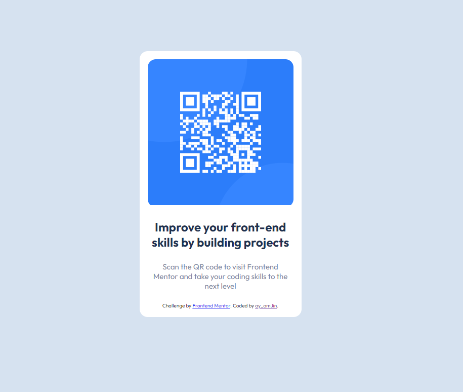

# Frontend Mentor - QR code component

## Welcome! 👋

Here is my simple solution to this QR code component Frontend Mentor challenge using basic HTML and CSS

## The challenge

The challenge is to build out this QR code component and get it looking as close to the design as possible.

